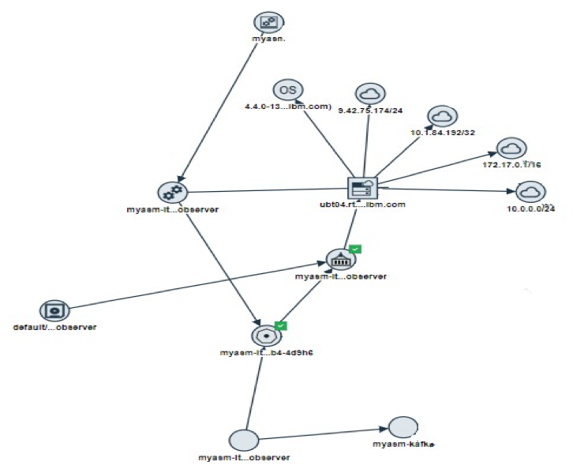
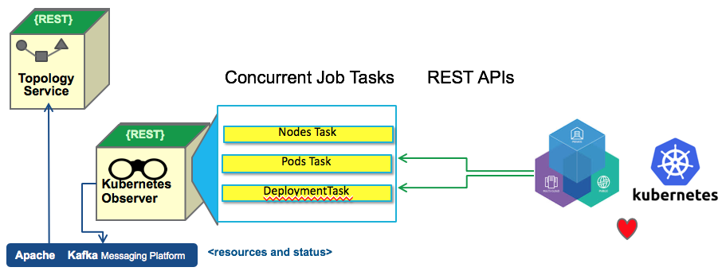
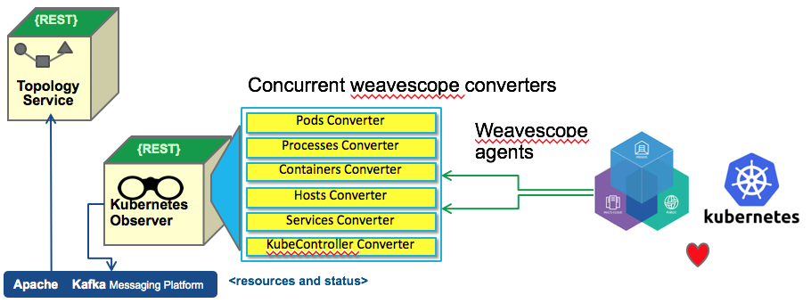

# Netcool Agile Service Manager

ASM consists of a number of services, and can be integrated into the IBM Netcool Operations Insight suite of products.
- You access Netcool Agile Service Manager through the IBM Dashboard Application Service Hub (DASH).
- One of ASM services is called an observer, a service that extracts resource information and inserts it into the Agile Service Manager database. Observer jobs are triggered by POSTing jobs via REST, and the REST API can be accessed via Swagger.
- One of the available Observer is the kubernetes observer. Using this observer, you can define jobs that discover the services you run on Kubernetes, and display Kubernetes containers and the relationships between them.  Here is an example of the topology built using kubernetes observer: 
- The Observer in ASM version 1.1.2 uses ‘query’ mode to retrieve data from Kubernetes Nodes, Namespaces, Pods and Services APIs and provides a ‘bulk’-style data load. 
- The latest release of ASM (version 1.1.3 released in 28th of September 2018) introduces the ‘listen’ mode that retrieves data from a weavescope agent. The model that it builds is more detail, it model relationships between Nodes, Pods, Containers, Deployments, DaemonSets, StatefulSets Services & Applications.
- Agile Service Manager uses Swagger, an open source software framework, which includes support for automated documentation and code generation.  The default location for the kubernetes observer document is http://<your host>/1.0/kubernetes-observer/swagger.
