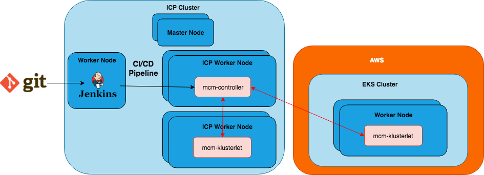
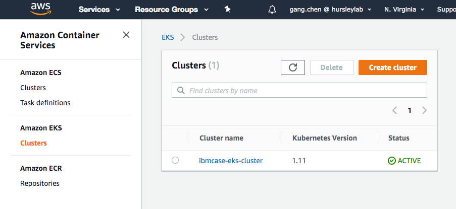
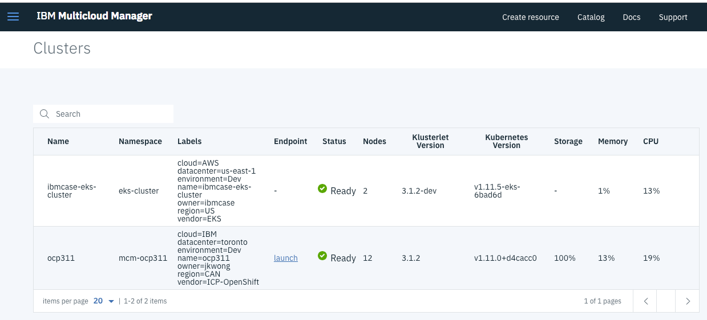
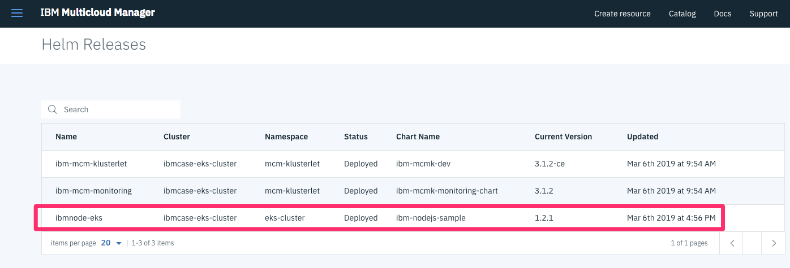

# Manage AWS EKS Clusters
Author: Gang Chen (gangchen@us.ibm.com)

This section focuses on how to manage an AWS hosted Kubernetes as a Service EKS cluster through MCM.

## Architecture


To manage an Amazon Elastic Container Service for Kubernetes (EKS) cluster, you need to install the IBM Multicloud Manager Klusterlet in an EKS cluster. This guide will walk through the detail setup and configuration under this architecture.

## Pre-Requisites
In order to go through this document, you are going to need the following:

* 1 x [IBM Cloud Private](https://www.ibm.com/support/knowledgecenter/en/SSBS6K_3.1.2/kc_welcome_containers.html) cluster.
* [IBM Multicloud Manager on ICP  (hub)](https://www.ibm.com/support/knowledgecenter/en/SSBS6K_3.1.2/mcm/installing/install.html)
* [Kubectl](https://kubernetes.io/docs/user-guide/kubectl-overview/) (Kubernetes CLI)
    + Follow the instructions [here](https://kubernetes.io/docs/tasks/tools/install-kubectl/) to install it on your platform.
* [MCM CLI](https://www.ibm.com/support/knowledgecenter/en/SSBS6K_3.1.2/mcm/installing/install.html#install_cli)
    + Follow the instructions [here](https://www.ibm.com/support/knowledgecenter/en/SSBS6K_3.1.2/mcm/installing/install.html#install_cli) to install it on your platform.

Essentially, you need to have the MCM hub controller already installed and configured before managing EKS clusters.

## 1. Prepare EKS cluster
You need to have an EKS cluster ready. We'll cover the high level steps here rather than going in detail on how to create an EKS cluster. [Getting Started with Amazon EKS](https://docs.aws.amazon.com/eks/latest/userguide/getting-started.html#eks-launch-workers) is pretty easy to follow to get an EKS cluster.

### a. Create your Amazon EKS Service Role
EKS kubernetes components uses this role to get Permission in AWS environment.
For the sample configuration, I defined a role as:

```bash
eksCaseServiceRole
```

### b. Create Cluster VPC and SecurityGroup
It is recommended that you create a unique VPC and SecurityGroup for each EKS cluster.
The getting started guide uses AWS CloudFormation to automate the VPC and SecurityGroup creation.


You'll need the VPC, Subnet and SecurityGroup information for later steps.

### c. Configure kubectl and AWS CLI to Work with EKS
In order for `kubectl` to interact with EKS, you'll need to configure the command line utilities to manage the authentication and authorization properly. Please follow these instruction to [Configure kubectl for EKS](https://docs.aws.amazon.com/eks/latest/userguide/getting-started.html#eks-configure-kubectl), which you can run from your workstation.

### d. Create EKS cluster
You can either create a cluster using AWS console or CLI. I used the console to create a cluster. You will be using the VPC and Security Group information created before when going through the cluster creation wizard.



As this point, you are just getting an empty EKS cluster with control plane provisioned. But you will be charged for $0.20 per hour going forward. Once you are done with the cluster, go ahead and delete it to avoid further charges.

You can validate that your cluster is running by running the following command"

```bash
kubectl get svc
```

You should see output similar to the following, which means that `kubectl` was configured properly:

```bash
NAME             TYPE        CLUSTER-IP   EXTERNAL-IP   PORT(S)   AGE
svc/kubernetes   ClusterIP   10.100.0.1   <none>        443/TCP   1m
```

### e. Launch and Configure EKS Worker Nodes
In order to install MCM Klusterlet or do anything with your EKS cluster, you need to provision Worker nodes (essentially a collection of EC2 instances) and join them to the EKS cluster. Again, Amazon suggest to use CloudFormation to provision and join EKS worker nodes. To do so, you will need to provide the VPC, Subnet, SecurityGroup and EKS cluster name that you created earlier in the Stack creation wizard.

Upon finishing the CloudFormation creation, you should see a stack similar to the following:


You can validate that your worker nodes joined the EKS cluster by running the following command:

```bash
$ kubectl get nodes
NAME                              STATUS    ROLES     AGE       VERSION
ip-192-168-1xx-22.ec2.internal    Ready     <none>    7h        v1.11.5
ip-192-168-1xx-117.ec2.internal   Ready     <none>    7h        v1.11.5
```

You can deploy sample apps to validate your cluster, but it is now ready to be managed by IBM MCM.

## 2. Install MCM Klusterlet on EKS
Here is the official documentation for [Installing the IBM Multicloud Manager Klusterlet Amazon Elastic Container Service for Kubernetes](https://www.ibm.com/support/knowledgecenter/en/SSBS6K_3.1.2/mcm/installing/mcm_eks.html). It is a pretty straight forward process to get the klusterlet installed with the new IBM Multicloud Manager inception container. To learn more about the inception image, checkout its Docker Hub page at:

* [https://hub.docker.com/r/ibmcom/mcm-inception-amd64](https://hub.docker.com/r/ibmcom/mcm-inception-amd64).

### a. Configure Installation
Before installing the klusterlet, you need to get the configuration file and add the EKS cluster information. To create the configuration file, run the following commands:

```bash
$ docker run -v $(pwd):/data -e LICENSE=accept \
    ibmcom/mcm-inception-amd64:3.1.2-ce \
    cp -r /installer/cluster.eks /data/cluster

$ cd cluster
```

At this point, you just need to update the `config.yaml` file and fill in the EKS cluster information:

* aws_access_key_id
* aws_secret_access_key
* aws_region
* eks-cluster
* cluster-name
* cluster-namespace
* cluster-tags
* hub-k8s-endpoint
    + This is the MCM HUB Cluster endpoint.
* hub-k8s-token
    + This is the MCM HUB Cluster access token.

Here is the sample file I used:

```yaml
## Kubernete Service Provider (DO NOT MODIFY)
kubernete_service_provider: eks

## Service Provider Specific Paramaters
aws:
  aws_access_key_id: <your_access_id>
  aws_secret_access_key: <your_secret_key>
  aws_region: us-east-1
  eks-cluster: ibmcase-eks-cluster

## Multicloud Manager Klusterlet Settings
klusterlet:
  cluster-name: ibmcase-eks-cluster
  cluster-namespace: eks-cluster
  cluster-tags:
    environment: 'Dev'
    owner: 'ibmcase'
    datacenter: 'auto-detect'
    region: 'auto-detect'
  hub-k8s-endpoint: https://mcm-mastr-xxx-xxxx-tor01.lb.bluemix.net:8001
  hub-k8s-token: xxxx
```

### b. Install Klusterlet - Run the Inception Container
To start the installation using the configuration file you provided, run the following command:

```bash
$ docker run --net=host -t -e LICENSE=accept \
    -v "$(pwd)":/installer/cluster \
    ibmcom/mcm-inception-amd64:3.1.2-ce \
    install-mcm-klusterlet -v
```

In couple of minutes, you should see the installation completion message similar to this:

```bash
...
...
...
NOTES:
Thank you for installing ibm-mcmk-dev.

Your release is named ibm-mcm-klusterlet.

To learn more about the release, try:

$ helm status ibm-mcm-klusterlet
$ helm get ibm-mcm-klusterlet
stdout_lines: <omitted>

TASK [addon : include_tasks] ************************************************************************************************************************
skipping: [localhost] => (item={'key': u'ibm-mcm-klusterlet', 'value': {u'path': u'/addon/ibm-mcmk-dev-3.1.2-ce.tgz', u'namespace': u'mcm-klusterlet', u'use_custom_template': True}})  => changed=false
item:
key: ibm-mcm-klusterlet
value:
  namespace: mcm-klusterlet
  path: /addon/ibm-mcmk-dev-3.1.2-ce.tgz
  use_custom_template: true
skip_reason: Conditional result was False

PLAY RECAP ******************************************************************************************************************************************
localhost                  : ok=47   changed=28   unreachable=0    failed=0   

Playbook run took 0 days, 0 hours, 0 minutes, 50 seconds

```

If you get an output similar to above, that means your EKS cluster is now ready to be managed by MCM! You can validate the installation by running the following command, which should show the `ibm-mcm-klusterlet-*` pods:

```bash
$ kubectl get pods --all-namespaces

NAMESPACE        NAME                                                              READY     STATUS    RESTARTS   AGE
kube-system      aws-node-dmwhw                                                    1/1       Running   0          8h
kube-system      aws-node-lfjxk                                                    1/1       Running   0          8h
kube-system      coredns-7bcbfc4774-fl48s                                          1/1       Running   0          22h
kube-system      coredns-7bcbfc4774-h22bw                                          1/1       Running   0          22h
kube-system      kube-proxy-2gsts                                                  1/1       Running   0          8h
kube-system      kube-proxy-gb6zz                                                  1/1       Running   0          8h
kube-system      tiller-deploy-b7f4768d6-vp9js                                     1/1       Running   0          6h
mcm-klusterlet   ibm-mcm-klusterlet-ibm-mcmk-dev-klusterlet-c49b87894-dgp7k        4/4       Running   0          6h
mcm-klusterlet   ibm-mcm-klusterlet-ibm-mcmk-dev-weave-scope-app-54dd79b6fblvfx6   2/2       Running   0          6h
mcm-klusterlet   ibm-mcm-klusterlet-ibm-mcmk-dev-weave-scope-pzw5c                 1/1       Running   0          6h
mcm-klusterlet   ibm-mcm-klusterlet-ibm-mcmk-dev-weave-scope-rlrcl                 1/1       Running   0          6h
mcm-klusterlet   ibm-mcm-monitoring-prometheus-6cb4d8dbdb-g4mbb                    2/2       Running   0          6h
```

If you log in to the MCM HUB console, you should see the EKS cluster show up in the **Clusters** page:




## 3. Deploy a Sample Application to the Managed EKS Cluster
### a. Deploy NodeJS Application
In MCM HUB Cluster console, click the `Catalog` button to go to the ICP applications catalog. Search for `node`, then click on the `ibm-node-sample` application, as shown below:


Click `Configure` to move to the Helm configuration page. Enter the following values:

* **Helm release name**: ibmnode-eks
* **Target namespace**: eks-cluster
* Click the checkbox under **License**.


To install on the application on the EKS cluster, make sure to click **Remote Install** (shown above), then in **Target Clusters** field drop down (shown below), check your target EKS cluster as deployment target.


Click **Install** to perform the installation on the EKS cluster.

### b. Validate NodeJS Application Installation on the MCM HUB Cluster Console
Now go back to the MCM HUB cluster console and go to the **Helm Releases** page to see that the app has been deployed to the EKS cluster:



### c. Validate NodeJS Application Installation from kubectl on EKS
To validate the NodeJS application installation, run the following command:

```bash
# Get the application pod
$ kubectl get pods -n eks-cluster # replace the namespace with the one you correlated
NAME                                               READY     STATUS    RESTARTS   AGE
ibmnode-eks-nodejssample-nodejs-54775f7845-ngf6f   1/1       Running   0          2m

# Get the application service
$ kubectl get svc -n eks-cluster
NAME                              TYPE       CLUSTER-IP       EXTERNAL-IP   PORT(S)          AGE
ibmnode-eks-nodejssample-nodejs   NodePort   10.100.220.242   <none>        3000:32337/TCP   3m
```

You should see the NodeJS pod and service are running. To see it in browser, you need to expose the service to AWS load balancer or Ingress. I'll leave that to you as homework.

Congratulations, you now have successfully integrated an EKS cluster with IBM Multicloud Manager and deployed an application on the EKS cluster through IBM Multicloud Manager.

## 4. Delete the EKS Cluster
It is suggested to delete the EKS cluster and worker nodes after testing completes to avoid further charts. To do so, please follow this guide on how to [Delete an EKS cluster](https://docs.aws.amazon.com/eks/latest/userguide/delete-cluster.html).

## Conclusion
Now that you know how to use MCM to manage, monitor, and deploy applications on EKS clusters, you should checkout the [DevOps in Multi-cluster Environment](mcm-devops.md) chapter and attempt to deploy applications to the EKS cluster with MCM using an automated CI/CD pipeline.