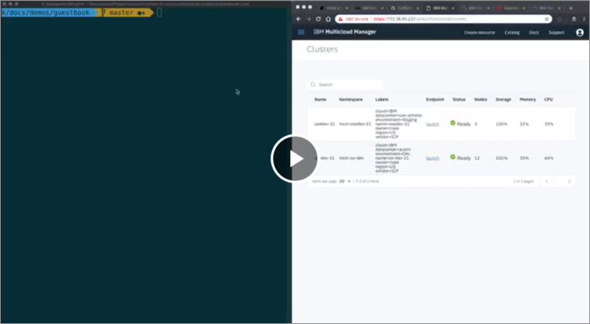
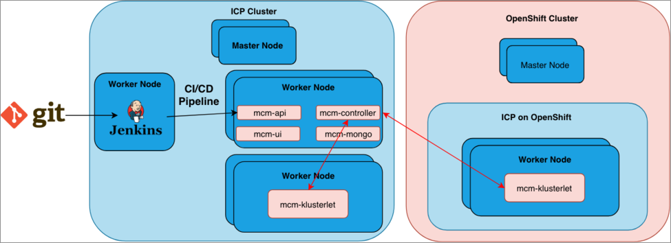

# Manage Red Hat OpenShift Clusters
**Author:** Fabio Gomez (fabiogomez@us.ibm.com)

This section focuses on demonstrating how to manage an IBM Cloud Private on OpenShift cluster through MCM.

<!--## Introduction Video
If you want a TL;DR; version of this document, feel free to watch this video, which goes over the contents of this document.

[](https://COMING_SOON.com)-->

## Architecture


Here is a breakdown of the architecture we will attempt to replicate and use in this document:

* 1 x [IBM Cloud Private](https://www.ibm.com/support/knowledgecenter/en/SSBS6K_3.1.2/kc_welcome_containers.html) cluster, which will serve as the `MCM Controller` to manage itself and another cluster with the help of the `MCM Klusterlet`.
* 1 x [IBM Cloud Private on OpenShift](https://www.ibm.com/support/knowledgecenter/en/SSBS6K_3.1.2/supported_environments/openshift/overview.html) cluster, which will be managed by the cluster above via the `MCM Klusterlet`.
* 1 x [Jenkins](https://jenkins.io/) instance running from inside the first cluster, which will run a CI/CD pipeline defined in a Git repository.


## Pre-Requisites
In order to go through this document, you are going to need the following:

* 1 x [IBM Cloud Private](https://www.ibm.com/support/knowledgecenter/en/SSBS6K_3.1.2/kc_welcome_containers.html) cluster.
* 1 x [IBM Cloud Private on OpenShift](https://www.ibm.com/support/knowledgecenter/en/SSBS6K_3.1.2/supported_environments/openshift/overview.html) cluster.
* [Kubectl](https://kubernetes.io/docs/user-guide/kubectl-overview/) (Kubernetes CLI)
    + Follow the instructions [here](https://kubernetes.io/docs/tasks/tools/install-kubectl/) to install it on your platform.
* [ICP Helm](https://github.com/kubernetes/helm) (Kubernetes package manager)
    + Follow the instructions [here](https://www.ibm.com/support/knowledgecenter/en/SSBS6K_3.1.2/app_center/create_helm_cli.html) to install it on your platform.
  * **Note**: It is important to use ICP provided Helm for Chart Management on ICP 3.1.
* [IBM Cloud Private CLI](https://www.ibm.com/support/knowledgecenter/en/SSBS6K_3.1.2/manage_cluster/icp_cli.html)
    + Follow the instructions [here](https://www.ibm.com/support/knowledgecenter/en/SSBS6K_3.1.2/manage_cluster/install_cli.html) to install it on your platform.
* [MCM CLI](https://www.ibm.com/support/knowledgecenter/en/SSBS6K_3.1.2/mcm/installing/install.html#install_cli)
    + Follow the instructions [here](https://www.ibm.com/support/knowledgecenter/en/SSBS6K_3.1.2/mcm/installing/install.html#install_cli) to install it on your platform.

In the following sections, you will learn how to setup MCM to manage these 2 clusters.

## 1. MCM Controller and Klusterlet Cluster Preparation
The first cluster will be the `MCM Controller`, which means that this cluster will be able to manage other clusters, itself included. In order for this cluster to become the MCM Controller and manage itself, we will need to install both the `MCM Controller` and the `MCM Klusterlet` Helm Charts. The MCM Controller is in charge of monitoring and send commands to all clusters. The `MCM Klusterlet` is responsible for reporting status back to the MCM Controller and implementing its instructions.

* Follow these [instructions](https://www.ibm.com/support/knowledgecenter/en/SSBS6K_3.1.2/mcm/installing/install.html) to install the MCM Controller and the MCM Klusterlet.
* In the Klusterlet section, for **Cluster Name** field enter `se-dev-31`.
* Make sure to use these labels and values for this cluster:
    + **cloud**: IBM
    + **datacenter**: austin
    + **environment**: Dev
    + **owner**: case
    + **region**: US
    + **vendor**: ICP

If the above was done correctly, you have successfully setup the first cluster and can now manage it through `MCM Controller`.

## 2. MCM Klusterlet Cluster Preparation
The second cluster will only contain the `MCM Klusterlet` that reports information back to the `MCM Controller` cluster.

* Follow these [instructions](https://www.ibm.com/support/knowledgecenter/en/SSBS6K_3.1.2/mcm/installing/mcm_openshift.html) to install the MCM Klusterlet.
* For **Cluster Name** field, enter `osedev-31`.
* Make sure to use these labels and values for this cluster:
    + **cloud**: IBM
    + **datacenter**: san-antonio
    + **environment**: Staging
    + **owner**: case
    + **region**: US
    + **vendor**: ICP

If the above was done correctly, you have successfully setup the first cluster and can now manage it through the `MCM Controller` in the first cluster.

## 3. Verifying ICP on OpenShift Cluster on MCM Dashboard
To verify that the ICP on OpenShift cluster shows up on the MCM Dashboard, open a new browser window and enter `https://MCM_CONTROLLER_MASTER_IP:8443/multicloud/clusters`. You can also open this view from ICP Web Console by clicking the `Hamburger button -> Multicloud Manager` to go to MCM console, then follow that with `hamburger button -> Clusters`.


If you see the `osedev-31` cluster above with a green checkmark icon under the `Status` column, then that means that the `MCM Klusterlet` was successfully installed on the ICP on OpenShift cluster. This means that the Klusterlet is reporting information back to the MCM Controller.

## Deploying an App through MCM
Now that the clusters have been setup properly with MCM, let's deploy a sample application on the ICP on OpenShift cluster through the `mcmctl` command line tool.

```bash
# Login against the MCM Controller Cluster
cloudctl login -a https://ICP_MASTER_IP:8443 -n default --skip-ssl-validation;

# Clone project repo
git clone https://github.com/ibm-cloud-architecture/kubernetes-multicloud-management.git

# Go to application directory
cd kubernetes-multicloud-management/demos/guestbook

# # Create the Image Policy in the ICP Cluster
kubectl apply -f guestbook-cluster-image-policy.yaml

# Install the Guestbook application on both clusters using the "owner" selector
#   with a value of "case" This value was used when installing the MCM Klusterlets.
# Also notice that we set the "replicaCount" field to "2", which means it will
#   install the application on up to 2 clusters that match the label selector.
helm upgrade --install guestbook --set replicaCount=2 --set targetCluster.labelSelector.matchLabels.owner=case gbapp --tls
```

If the above was done correctly, then the application was deployed to both clusters usin only one `helm upgrade` command using the `owner` cluster selector that was passed above. This is possible because both clusters share a cluster selector label value of `case` for the `owner` field. The MCM Controller looks up clusters that match those labels and then deploys the application to those clusters.

For more details on the `guestbook` application, check out the helm chart [here](https://github.com/ibm-cloud-architecture/kubernetes-multicloud-management/tree/master/demos/guestbook/gbapp).

To verify that the application was created in MCM and deployed to both clusters, let's run the following command:

```bash
# Get the application
mcmctl get applications

NAME              LABELSELECTOR                             KINDS       AGE       DASHBAORD
guestbook-gbapp   Expression:app In [gbapp,gbf,gbrm,gbrs]   Pods.core   1d        https://172.16.50.227:8443/grafana/dashboard/db/guestbook-gbapp-dashboard-via-federated-prometheus
```

If you see the `guestbook-gbapp` above that means that the application was successfully registered in MCM Controller.

To verify that the application deployments were created in the ICP on OpenShift cluster, run the following command:
```bash
mcmctl --cluster-selector environment=Staging get deployments

CLUSTER     NAME                                            AGE
osedev-31   md-guestbook-gbapp-osedev-31-gbf                11h
osedev-31   md-guestbook-gbapp-redismaster-osedev-31-gbrm   11h
osedev-31   md-guestbook-gbapp-redisslave-osedev-31-gbrs    11h
```

If you see the `md-guestbook-gbapp`, `md-guestbook-gbapp-redismaster`, and `md-guestbook-gbapp-redisslave` deployments above, this means that the MCM Controller successfully deployed the application on the ICP on OpenShift cluster!

## Verifying the Application on MCM Console
Now that we verified that the application was successfully deployed on the ICP on OpenShift cluster through MCM, let's see what that the appplication looks like from the MCM Controller Console. To see the applications view, open a browser and go to `https://MCM_CONTROLLER_MASTER_IP:8443/multicloud/applications`


You should be able to see the `guestbook-gbapp` application above, which means that the application was successfully registered in the MCM Controller. Now click on the application name to go to a more in-details view of the application. Feel free to explore all of the menus in this view, but if you scroll all the way down you will see the most important part of this view below:


The above shows the `Placement Policies`, which show the criteria used to deploy the application on multiple clusters. Pay attention to the fields and values for **matchLabels** under **Cluster Selector**. Do you recognize the **owner** field with a value of `case`? This is the same field that we passed along in the `helm upgrade` command.


Also notice under the **Deployable Objects** the `guestbook-gbapp`, `guestbook-gbapp-redismaster`, and the `guestbook-gbapp-redisslave` objects. Those are the `guestbook` helm charts that were deployed with the `gbapp` application chart.

That's all you need to verify through MCM Console that the application was deployed to both clusters.

## Verifying the Application on ICP on OpenShift Console
Now that have deployed the application on the ICP on OpenShift cluster, let's verify the installation from the ICP on OpenShift console and test its functinality to make sure that everything works as expected. To access the ICP on OpenShift dashboard, open a new browser and go to `https://ICP_OPENSHIFT_MASTER_IP:5443/console/workloads/deployments` to see the existing deployments.


If you are able to see the `md-guestbook-gbapp-frontend`, `md-guestbook-gbapp-redismaster`, and `md-guestbook-gbapp-redisslave` deployments and all have an **Available** value of `1`, then this means that all of the deployments have succesfully been deployed and started. You might need to search for `guestbook` and make sure the view is displaying deployments for all the namespaces to be able to see them.

To test the application itself, go ahead and click the `Launch` button at the end of the `md-guestbook-gbapp` row, which will open a new browser window to display the guestbook web application, as shown below.


The guestbook application itself is very simple. It consists of a web application that saves `guest` names to a Redis deployment and persists them there even if the web application dies or restarts for some reason. To test its functionality, enter any text in the textbox shown above and click the `Submit` button. If everything worked successfully, you will see that the text you entered has now moved below the Submit button, which indicates that the text has been saved to and successfully read from the Redis deployment. To make sure that the text persists in the Redis deployment, feel free to refresh the page and make sure that the text you entered is bein shown again below the `Submit` button.

If all the above was done successfully, that means that you have successfully verified the guestbook deployment and tested its functionality!

## Verifying the Application on OpenShift Console
The last step that remains is to verify that the guestbook deployments are shown on the OpenShift console itself. To do that, open a new browser and go to `https://ICP_OPENSHIFT_MASTER_IP:8443/console/project/default/overview`, where `default` is the name of the OpenShift project (known as a namespace in ICP/Kubernetes terms).


If you are able to see the `md-guestbook-gbapp`, `md-guestbook-gbapp-redismaster`, and `md-guestbook-gbapp-redisslave` deployments and all have at least `1` pod available, then this means that all of the deployments have succesfully been deployed and started. You might need to search for `guestbook` and make sure the view is displaying deployments for all the namespaces to be able to see them.

## Conclusion
Now that you know how to use MCM to manage, monitor, and deploy applications on IBM Cloud Private and IBM Cloud Private on OpenShift clusters, you should checkout the [Manage AWS EKS clusters with MCM](mcm-eks.md) to learn how to use MCM to manage, monitor, and deploy applications on AWS EKS clusters.